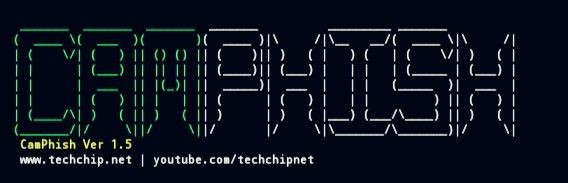

<p align="center">
  
</p>

# Camphish

## 📌 Overview

Camphish is an educational cybersecurity project used to demonstrate how camera and location permissions can be requested through a web page in a controlled and authorized environment.

It helps cybersecurity students and ethical hackers understand the importance of browser permissions, user awareness, and security best practices.

> **Disclaimer:** This project is intended for educational purposes, security research, and authorized testing only. Always obtain permission before testing on any device, network, or user.

---

# 🎯 Purpose

The purpose of this project is to help learners understand:

* Browser permission requests
* Camera permission behavior
* Location permission behavior
* User awareness in cybersecurity
* Social engineering awareness
* Ethical hacking concepts

---

# ✨ Features

* Browser-based permission demonstration
* Camera access request
* Location access request
* Multiple demo page templates
* Tunnel support for testing in controlled environments
* Lightweight and easy to use for learning

---

# 🛠 Requirements

Before running the project, make sure you have:

* Linux (Recommended: Kali Linux)
* PHP
* Git
* Internet connection
* A supported tunnel service (if required for your lab environment)

---

# 📂 Project Structure

```text
Camphish/
│
├── README.md
├── Installation.md
├── Usage.md
├── Templates.md
├── Common-Errors.md
├── FAQ.md
├── LICENSE
└── assets/
```

---

# 📚 Learning Objectives

After studying this project, you will understand:

* How browsers handle permission requests
* Why users should carefully review permission prompts
* The role of user awareness in cybersecurity
* Ethical considerations when testing web applications

---

# ⚠ Ethical Use

Use this project only in environments where you have explicit authorization.

Never use it against individuals, organizations, or systems without permission. Unauthorized testing may violate laws, organizational policies, and ethical standards.

---

# 👨‍💻 Intended Audience

This repository is designed for:

* Cybersecurity Students
* Ethical Hackers
* Penetration Testers
* Security Researchers
* CTF Participants
* IT Professionals

---

# 📖 Disclaimer

The information provided in this repository is for educational and defensive security purposes only. The author is not responsible for any misuse of the information or software.

---

# 📄 License

This project is released under the MIT License.


---

> 💡 *This README is for educational purposes — designed to help beginners understand the core concepts of Digital_Forensic & Ethical_Hacking clearly and professionally.*

---

🧠 **Author:** *[Sharmeen Fatima](https://github.com/sharmeen-fatima)*  
📅 **Last Updated:** *02 June 2026*  

- **📫 Feel free to reach out: **✉️ (Sharmeenfatima67@gmail.com).****
- ***✒ For more information about Digital_Forensic & Ethical_Hacking and updates Join **[Whatsapp Channel](https://whatsapp.com/channel/0029VbAqY7w002TIRJYUHG3X).*****


***“Learning never stops — stay curious, stay creative!”***


***☺️STAY HERE, STAY CONNECTED✨***

